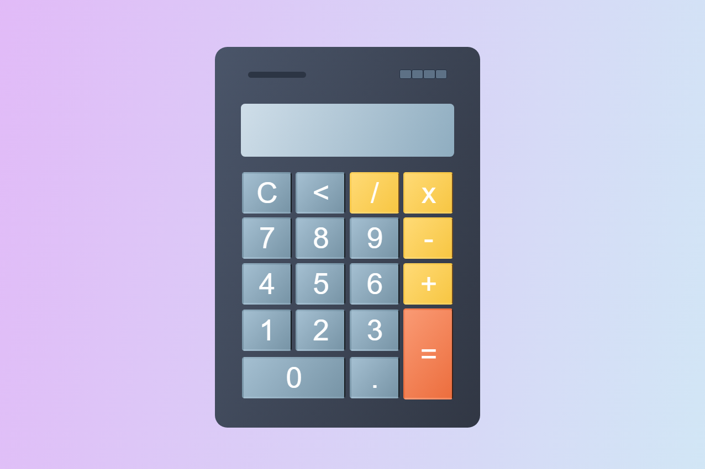

# 🧮 Calculadora em JavaScript 

Este repositório contém uma calculadora simples desenvolvida com JavaScript, HTML e CSS. O projeto foi criado com o auxílio de um tutorial do canal "Gustavo Neitzke" (YouTube), que explica como construir uma calculadora funcional do zero. Algumas modificações foram feitas para personalizar o estilo e adicionar funcionalidades extras.

- **Link do tutorial**: ["Como criar uma calculadora simples"](https://youtu.be/42TShjXR0m0?si=mdwESNx0K659JMwv)

## Funcionalidades

- Adicionar números e operadores ao display da calculadora;
- Realizar operações matemáticas básicas (soma, subtração, multiplicação e divisão);
- Limpar o display;
- Limitar a entrada de números no display a 15 caracteres para evitar problemas visuais.

## Tecnologias Utilizadas

- **HTML**: Estrutura básica da calculadora;
- **CSS**: Estilização da interface;
- **JavaScript**: Lógica das operações e interatividade.

## Captura de tela

